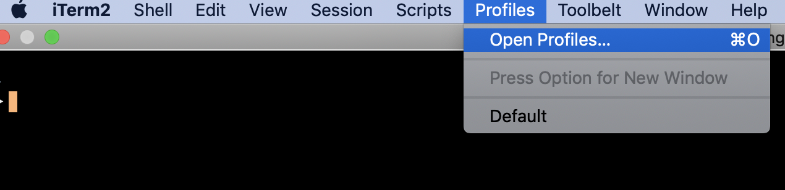
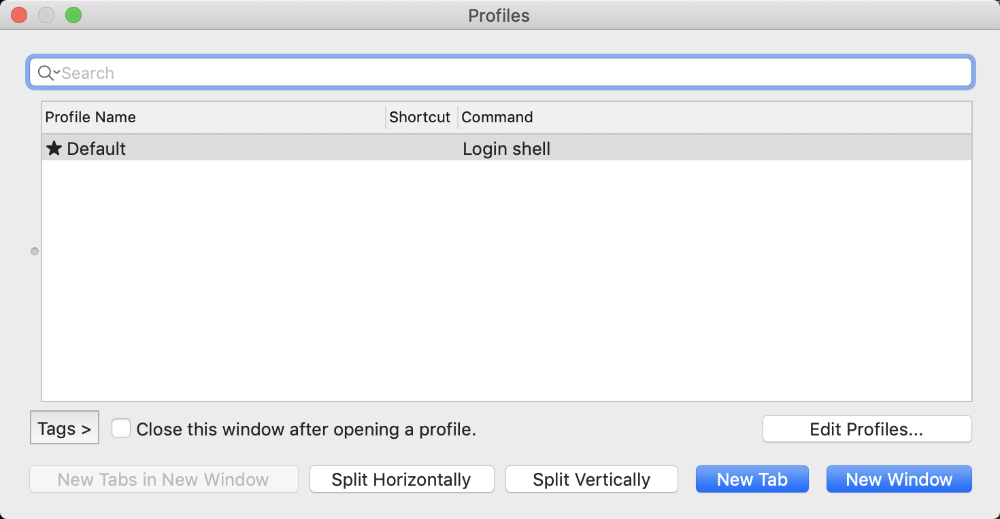
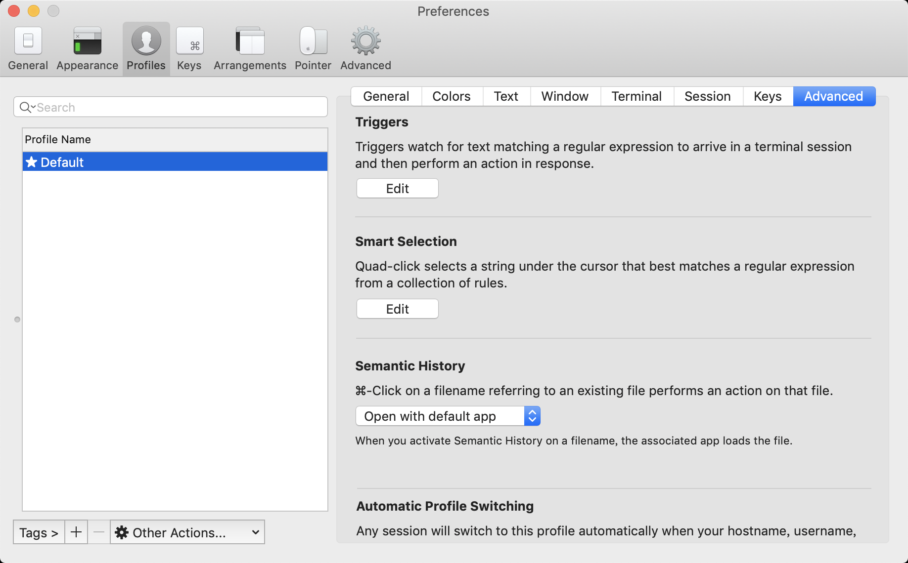
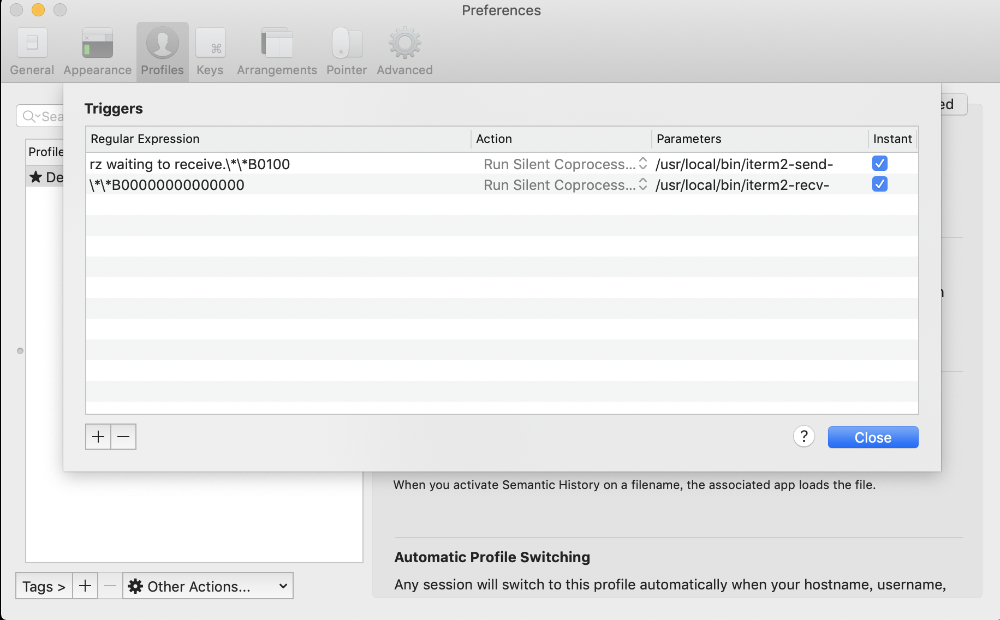

# README

在mac下，实现本地与服务器进行便捷的文件上传和下载操作


## 步骤

### 安装lrzsz

该软件包支持rz和sz命令的包

```
▶ brew install lrzsz
==> Downloading https://homebrew.bintray.com/bottles/lrzsz-0.12.20_1.mojave.bottle.tar.gz
######################################################################## 100.0%
==> Pouring lrzsz-0.12.20_1.mojave.bottle.tar.gz
🍺  /usr/local/Cellar/lrzsz/0.12.20_1: 18 files, 473.5KB
```

### 脚本设置

将脚本`iterm2-send-zmodem.sh` 和`iterm2-recv-zmodem.sh`拷贝到本地`/usr/local/bin/`目录下，并将权限设置为777。

```
▶ cp iterm2-* /usr/local/bin
▶ chmod 777 /usr/local/bin/iterm2-*
```

### 设置Iterm2的Tirgger特性

1、打开profiles





点击 edit profiles

2、preferences



点击Advanced中的Tirggers->Edit

3、add triggers

添加两条trigger，分别设置 Regular expression，Action，Parameters，Instant如下

第一条：

```
Regular expression: rz waiting to receive.\*\*B0100
Action: Run Silent Coprocess
Parameters: /usr/local/bin/iterm2-send-zmodem.sh
Instant: checked
```

第二条：

```
Regular expression: \*\*B00000000000000
Action: Run Silent Coprocess
Parameters: /usr/local/bin/iterm2-recv-zmodem.sh
Instant: checked
```

如下图所示：



## 使用方法

场景：在服务器上

1、rz

从本机拷贝文件到服务器上

```
$ rz
rz waiting to receive.**B0100000023be50
```

此时会跳出一个框 ，选择本地要上传的文件

```
$ # Received /Users/xiaqunfeng/Downloads/file.tar
```

此时发现，文件已经拷贝到服务器上了

2、sz

将服务器上文件拷贝到本机

```
$ sz file.tar
**B00000000000000
$ # Sent -> /Users/xiaqunfeng/Downloads/
```

此时文件 file.tar 已下载到Downloads目录下